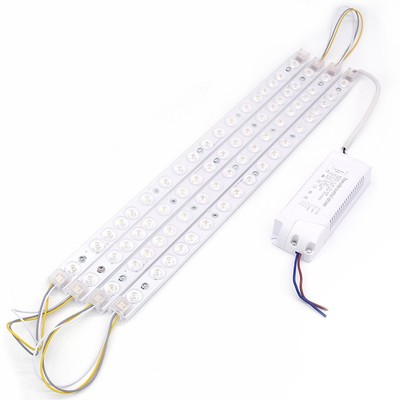

# ESPurna Firmware

ESPurna ("spark" in Catalan) is a custom firmware for ESP8266 based smart switches.
It was originally developed with the **[IteadStudio Sonoff][1]** in mind but now it supports a growing number of ESP8266-based boards.
It uses the Arduino Core for ESP8266 framework and a number of 3rd party libraries.

**Current Release Version is 1.2.0**, read the [changelog](CHANGELOG.md).

## Features

* Support for **multiple ESP8266-based boards** ([check list](#supported-hardware))
* Wifi **AP Mode** or **STA mode** with **multiple network definitions**
* **MQTT** enabled
 * Switch on/off and toggle relays
 * LED notifications
* Support for different **sensors**
 * DHT11 / DHT22 / DHT21 / AM2301
 * DS18B20
 * HLW8012 (Sonoff POW)
 * Non-invasive current sensor using the [EmonLiteESP Library][3] (requires some hacking)
* Fast asynchronous **HTTP Server**
 * Basic authentication
 * Web-based configuration
 * Relay switching from the web
 * Websockets-based communication between the device and the browser
* **REST API**
 * GET and PUT relay status
* **Command line configuration**
* **Over-The-Air** (OTA) updates even for 1Mb boards
 * Manually from PlatformIO or Arduino Inside
 * Automatic updates through the [NoFUSS Library][2]
* **Alexa** integration (requires staging version of Arduino Core for ESP8266)

## Documentation

For more information please refer to the [ESPurna Wiki](https://bitbucket.org/xoseperez/espurna/wiki/Home).

## Supported hardware

<table style="text-align: center">
<tr>
<td style="border-width: 0px;">  **IteadStudio S20**</td>
<td style="border-width: 0px;">  **IteadStudio Slampher**</td>
<td style="border-width: 0px;">  **IteadStudio Sonoff 4CH**</td>
</tr>
<tr>
<td style="border-width: 0px;">  **IteadStudio Sonoff Basic**</td>
<td style="border-width: 0px;">  **IteadStudio Motor Switch**</td>
<td style="border-width: 0px;">  **IteadStudio 1CH Inching**</td>
</tr>
<tr>
<td style="border-width: 0px;">  **IteadStudio Sonoff Dual**</td>
<td style="border-width: 0px;">  **IteadStudio Sonoff POW**</td>
<td style="border-width: 0px;">  **IteadStudio Sonoff TH10/TH16**</td>
</tr>
<tr>
<td style="border-width: 0px;">  **IteadStudio Sonoff RF**</td>
<td style="border-width: 0px;">  **IteadStudio Sonoff SV**</td>
<td style="border-width: 0px;">  **IteadStudio Sonoff LED**</td>
</tr>
<tr>
<td style="border-width: 0px;">  **IteadStudio Sonoff Touch**</td>
<td style="border-width: 0px;">  **Electrodragon Relay Board**</td>
<td style="border-width: 0px;">  **WorkChoice EcoPlug**</td>
</tr>
</table>

## License

Copyright (C) 2016 by Xose Pérez (@xoseperez)

This program is free software: you can redistribute it and/or modify
it under the terms of the GNU General Public License as published by
the Free Software Foundation, either version 3 of the License, or
(at your option) any later version.

This program is distributed in the hope that it will be useful,
but WITHOUT ANY WARRANTY; without even the implied warranty of
MERCHANTABILITY or FITNESS FOR A PARTICULAR PURPOSE.  See the
GNU General Public License for more details.

You should have received a copy of the GNU General Public License
along with this program.  If not, see <http://www.gnu.org/licenses/>.

[1]: https://www.itead.cc/sonoff-wifi-wireless-switch.html
[2]: https://bitbucket.org/xoseperez/nofuss
[3]: https://bitbucket.org/xoseperez/emonliteesp
