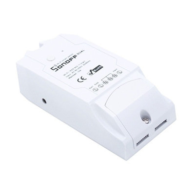

# ESPurna Firmware

ESPurna ("spark" in Catalan) is a custom firmware for ESP8266 based smart switches.
It was originally developed with the **[IteadStudio Sonoff](https://www.itead.cc/sonoff-wifi-wireless-switch.html)** in mind but now it supports a growing number of ESP8266-based boards.
It uses the Arduino Core for ESP8266 framework and a number of 3rd party libraries.

**Current Release Version is 1.9.2**, read the [changelog](https://bitbucket.org/xoseperez/espurna/src/master/CHANGELOG.md).

## Features

* Support for **multiple ESP8266-based boards** ([check list](https://bitbucket.org/xoseperez/espurna/wiki/Hardware))
* Wifi **AP Mode** or **STA mode**
    * Up to 5 different networks can be defined
    * Supports static IP
    * Scans for strongest network if more than one defined
    * Defaults to AP mode (also available after double clicking the main button)
* Switch management
    * Support for **push buttons** and **toggle switches**
    * Configurable **status on boot** (always ON, always OFF, same as before or toggle)
    * Support for **pulse mode** (normally ON or normally OFF) with configurable time
    * Support for **relay synchronization** (all equal, only one ON, one and only on ON)
    * Support for **delayed ON/OFF**
* **MQTT** enabled
    * **SSL/TLS support** (not on regular builds, requires staging version of Arduino Core for ESP8266)
    * Switch on/off and toggle relays
    * Report button event notifications
    * Enable/disable pulse mode
    * Change LED notification mode
    * Remote reset the board
* **Alexa** integration using the [FauxmoESP Library](https://bitbucket.org/xoseperez/fauxmoesp)
* [**Domoticz**](https://domoticz.com/) integration via MQTT
* [**Home Assistant**](https://home-assistant.io/) integration via MQTT
    * Supports MQTT auto-discover feature
* [**InfluxDB**](https://www.influxdata.com/) integration via HTTP API
* Support for different **sensors**
    * DHT11 / DHT22 / DHT21 / AM2301 (supports celsius & fahrenheit reporting)
    * DS18B20 (supports celsius & fahrenheit reporting)
    * HLW8012 using the [HLW8012 Library](https://bitbucket.org/xoseperez/hlw8012) (Sonoff POW)
    * Non-invasive current sensor using the [EmonLiteESP Library](https://bitbucket.org/xoseperez/emonliteesp) (requires some hacking)
    * Raw analog sensor
* Fast asynchronous **HTTP Server**
    * Configurable port
    * Basic authentication
    * Web-based configuration
    * Relay switching and sensor data from the web interface
    * Handle color, brightness, and white/warm channels for lights
    * Websockets-based communication between the device and the browser
    * Backup and restore settings option
    * Upgrade firmware from the web interface
* **REST API** (enable/disable from web interface)
    * GET and PUT relay status
    * Change light color (for supported hardware)
    * GET sensor data (power, current, voltage, temperature and humidity) depending on the available hardware
* **RPC API** (enable/disable from web interface)
    * Remote reset the board
* **Over-The-Air** (OTA) updates even for 1Mb boards
    * Manually from PlatformIO or Arduino IDE
    * Automatic updates through the [NoFUSS Library](https://bitbucket.org/xoseperez/nofuss)
    * Update from web interface using pre-built images
* **Command line configuration**
    * Change configuration
    * Run special commands
* **Telnet support**
    * Available only if connected to the AP interface
    * Show debug info and allows to run terminal commands
* **Unstable system check**
    * Detects unstable system (crashes on boot continuously) and defaults to a stable system
    * Only WiFi AP, OTA and Telnet available if system is flagged as unstable
* Button interface
    * Click to toggle relays
    * Double click to enter AP mode (only main button)
    * Long click (>1 second) to reboot device (only main button)
    * Extra long click (>10 seconds) to go back to factory settings (only main button)

## Documentation

For more information please refer to the [ESPurna Wiki](https://bitbucket.org/xoseperez/espurna/wiki/Home).

## Supported hardware

Here is the list of supported hardware. For more information please refer to the [ESPurna Wiki Hardware page](https://bitbucket.org/xoseperez/espurna/wiki/Hardware).

||||
|---|---|---|
||||
|**Tinkerman ESPurna H**|**IteadStudio Sonoff RF Bridge**||
||||
|**IteadStudio Sonoff Basic**|**IteadStudio Sonoff RF**|**Electrodragon WiFi IOT**|
||||
|**IteadStudio Sonoff Dual**|**IteadStudio Sonoff POW**|**IteadStudio Sonoff TH10/TH16**|
||||
|**IteadStudio Sonoff 4CH**|**IteadStudio Sonoff 4CH Pro**|**OpenEnergyMonitor WiFi MQTT Relay / Thermostat**|
||||
|**IteadStudio S20**|**WorkChoice EcoPlug**||
||||
|**IteadStudio Sonoff Touch**|**IteadStudio Sonoff T1**||
||||
|**IteadStudio Slampher**|**AI-Thinker Wifi Light / Noduino OpenLight**|**IteadStudio Sonoff B1**|
||||
|**MagicHome LED Controller**|**Huacanxing H801**|**Itead BN-SZ01**|
||||
|**IteadStudio Sonoff SV**|**IteadStudio 1CH Inching**|**IteadStudio Motor Clockwise/Anticlockwise**|
||||
|**Wemos D1 Mini Relay Shield**|**Jan Goedeke Wifi Relay (NO/NC)**|**Jorge García Wifi + Relays Board Kit**|
||||
|**EXS Wifi Relay v3.1**|||

## License

Copyright (C) 2016-2017 by Xose Pérez (@xoseperez)

This program is free software: you can redistribute it and/or modify
it under the terms of the GNU General Public License as published by
the Free Software Foundation, either version 3 of the License, or
(at your option) any later version.

This program is distributed in the hope that it will be useful,
but WITHOUT ANY WARRANTY; without even the implied warranty of
MERCHANTABILITY or FITNESS FOR A PARTICULAR PURPOSE.  See the
GNU General Public License for more details.

You should have received a copy of the GNU General Public License
along with this program.  If not, see <http://www.gnu.org/licenses/>.
