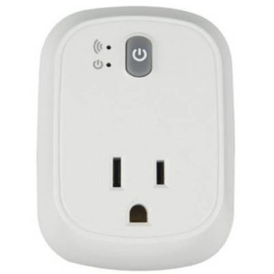

# ESPurna Firmware

ESPurna ("spark" in Catalan) is a custom firmware for ESP8266 based smart switches.
It was originally developed with the **[IteadStudio Sonoff](https://www.itead.cc/sonoff-wifi-wireless-switch.html)** in mind but now it supports a growing number of ESP8266-based boards.
It uses the Arduino Core for ESP8266 framework and a number of 3rd party libraries.

**Current Release Version is 1.4.3**, read the [changelog](CHANGELOG.md).

## Features

* Support for **multiple ESP8266-based boards** ([check list](#supported-hardware))
* Wifi **AP Mode** or **STA mode** with **multiple network definitions** and static IP support
* **MQTT** enabled
    * Switch on/off and toggle relays
    * LED notifications
* Support for different **sensors**
    * DHT11 / DHT22 / DHT21 / AM2301
    * DS18B20
    * HLW8012 (Sonoff POW)
    * Non-invasive current sensor using the [EmonLiteESP Library](https://bitbucket.org/xoseperez/emonliteesp) (requires some hacking)
* Fast asynchronous **HTTP Server**
    * Basic authentication
    * Web-based configuration
    * Relay switching from the web
    * Websockets-based communication between the device and the browser
* **REST API**
    * GET and PUT relay status
* **Command line configuration**
* **Over-The-Air** (OTA) updates even for 1Mb boards
    * Manually from PlatformIO or Arduino Inside
    * Automatic updates through the [NoFUSS Library](https://bitbucket.org/xoseperez/nofuss)
* **Alexa** integration using the [FauxmoESP Library](https://bitbucket.org/xoseperez/fauxmoesp)
* [**Domoticz**](https://domoticz.com/) integration via MQTT

## Documentation

For more information please refer to the [ESPurna Wiki](https://bitbucket.org/xoseperez/espurna/wiki/Home).

## Supported hardware

| **IteadStudio S20**| **IteadStudio Slampher**| **IteadStudio Sonoff 4CH**|
| **IteadStudio Sonoff Basic**| **IteadStudio Motor Switch**| **IteadStudio 1CH Inching**|
| **IteadStudio Sonoff Dual**| **IteadStudio Sonoff POW**| **IteadStudio Sonoff TH10/TH16**|
| **IteadStudio Sonoff RF**| **IteadStudio Sonoff SV**| **IteadStudio Sonoff Touch**|
| **Wemos D1 Mini Relay Shield**| **Electrodragon Relay Board**| **WorkChoice EcoPlug**|

## License

Copyright (C) 2016-2017 by Xose Pérez (@xoseperez)

This program is free software: you can redistribute it and/or modify
it under the terms of the GNU General Public License as published by
the Free Software Foundation, either version 3 of the License, or
(at your option) any later version.

This program is distributed in the hope that it will be useful,
but WITHOUT ANY WARRANTY; without even the implied warranty of
MERCHANTABILITY or FITNESS FOR A PARTICULAR PURPOSE.  See the
GNU General Public License for more details.

You should have received a copy of the GNU General Public License
along with this program.  If not, see <http://www.gnu.org/licenses/>.
