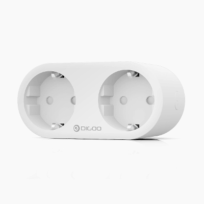
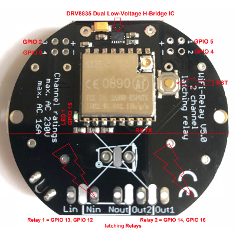
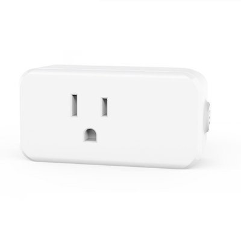
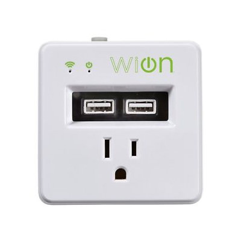
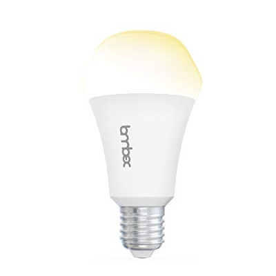
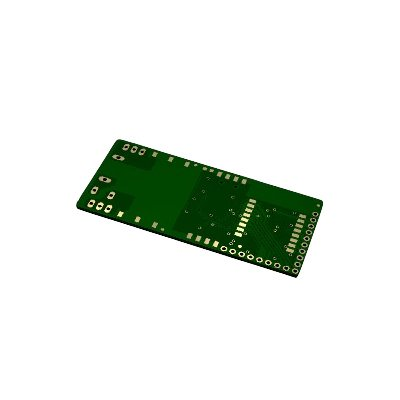

# ESPurna Firmware

ESPurna ("spark" in Catalan) is a custom firmware for ESP8285/ESP8266 based smart switches, lights and sensors.
It uses the Arduino Core for ESP8266 framework and a number of 3rd party libraries.

 

 

---

## Collaborators

Since November 2018, Max Prokhorov (**@mcspr**) is also actively working as a collaborator of the project. 

## Contributors

**Without your help this project would not be possible**. I (**@xoseperez**) simply can't spend all the time I wish on ESPurna but luckly I recieve a lot of contributions, bug fixes, enhancement suggestions,... from people all around the world. I would like to thank each and every one of you. The [contributors](https://github.com/xoseperez/espurna/graphs/contributors) page shows the ones that have done a PR in the past, but I also get contributions in the issues, by email or via the [gitter ESPurna channel](https://gitter.im/tinkerman-cat/espurna), those I also want to thank.

**Thank you all very much**.

## Notice

> Ladies and gentlemen in the embedded world, use [PlatformIO](https://platformio.org/). If I could offer you only one tip for the future, [PlatformIO](https://platformio.org/) would be it.

> Please use the [gitter ESPurna channel](https://gitter.im/tinkerman-cat/espurna) for support and questions, you have better chances to get fast answers from me or other ESPurna users. Open an issue here only if you feel there is a bug or you want to request an enhancement. Thank you.

> Process of building ESPurna from source is documented in the Wiki:  
[Using PlatformIO IDE for VSCode](https://github.com/xoseperez/espurna/wiki/Build-and-update-from-Visual-Studio-Code-using-PlatformIO)  
[Using PlatformIO CLI](https://github.com/xoseperez/espurna/wiki/PlatformIO)  
[Using Arduino IDE](https://github.com/xoseperez/espurna/wiki/ArduinoIDE)  

> If you want to try out latest changes from **dev** branch without building the firmware yourself or if you are having problems with the stable release, please visit [**espurna-nightly-builder** releases page](https://github.com/mcspr/espurna-nightly-builder/releases).

## Features

* *KRACK* vulnerability free (when built with Arduino Core >= 2.4.0)
* Support for **multiple ESP8266-based boards** ([check list](https://github.com/xoseperez/espurna/wiki/Hardware))
* Power saving options
* Wifi **AP Mode** or **STA mode**
    * Supports static IP
    * Up to 5 different networks can be defined
    * Scans for strongest network if more than one defined (also available in web UI)
    * Handles correctly multiple AP with the same SSID
    * Defaults to AP mode (also available after double clicking the main button)
    * Support for **WPS** and **Smart Config** (not available in default builds)
* Network visibility
    * Supports mDNS (service reporting and metadata) both server mode and client mode (.local name resolution)
    * Supports NetBIOS, LLMNR and Netbios (when built with Arduino Core >= 2.4.0) and SSDP (experimental)
* Switch management
    * Support for **push buttons** and **toggle switches**
    * Support for **digital** and [**analog**](https://en.wikipedia.org/wiki/Resistor_ladder) buttons
    * Configurable **status on boot** per switch (always ON, always OFF, same as before or toggle)
    * Support for **pulse mode** per switch (normally ON or normally OFF) with configurable time
    * Support for **relay synchronization** (all equal, only one ON, one and only on ON)
    * Support for **MQTT groups** to sync switches between devices
    * Support for **delayed ON/OFF**
    * Support for **latched relays**
* **MQTT** enabled
    * **SSL/TLS support** (not on regular builds, see [#64](https://github.com/xoseperez/espurna/issues/64) and [#1465](https://github.com/xoseperez/espurna/issues/1465))
    * Switch on/off and toggle relays, group topics (sync relays between different devices)
    * Report button event notifications
    * Enable/disable pulse mode
    * Change LED notification mode
    * Remote reset the board
    * Fully configurable in webUI (broker, user, password, QoS, keep alive time, retain flag, client ID)
* **Scheduler** to automatically turn on, off or toggle any relay at a given time and day, also change light intensity for dimmers
* **Alexa** integration using the [FauxmoESP Library](https://bitbucket.org/xoseperez/fauxmoesp)
* [**Google Assistant**](http://tinkerman.cat/using-google-assistant-control-your-esp8266-devices/) integration using IFTTT and Webhooks (Google Home, Allo)
* [**Domoticz**](https://domoticz.com/) integration via MQTT
* [**Home Assistant**](https://home-assistant.io/) integration
    * Support for switches (on/off)
    * Support for lights (color, brightness, on/off state)
    * Supports MQTT auto-discover feature (switches, lights and sensors)
    * Integration via MQTT Discover or copy-pasting configuration code
* [**InfluxDB**](https://www.influxdata.com/) integration via HTTP API
* [**Prometheus**](https://prometheus.io/) metrics integration via HTTP API
* [**Thingspeak**](https://thingspeak.com/) integration via HTTP API (HTTPS available for custom builds)
* **Sonoff RF Bridge** support
    * Multiple virtual switches (tested with up to 16)
    * MQTT-to-RF two-way bridge (no need to learn codes)
    * Support for [https://github.com/Portisch/RF-Bridge-EFM8BB1](https://github.com/Portisch/RF-Bridge-EFM8BB1) custom firmware
    * Support for [direct control of the encoder/decoder bypassing the EFM8BB1](https://github.com/xoseperez/espurna/wiki/Hardware-Itead-Sonoff-RF-Bridge---Direct-Hack)
* Support for [different **sensors**](Sensors)
    * Environment
        * **DHT11 / DHT12 / DHT22 / DHT21 / AM2301 / Itead's SI7021**
        * **BMP180**, **BMP280** and **BME280** pressure, humidity (BME280) and temperature (BMP280 & BME280) sensor by Bosch
        * **BME680** pressure, humidity, temperature and gas sensor by Bosch with support for Bosch's proprietary library BSEC for accurate Indoor Air Quality (IAQ) monitoring (⚠️ [learn more](https://github.com/xoseperez/espurna/wiki/Sensors#bme680-environmental-sensor))
        * **TMP35** and **TMP36** analog temperature sensors
        * **MAX6675** temperature sensor
        * **NTC** temperature sensors
        * **SI7021** temperature and humidity sensor
        * **SHT3X** temperature and humidity sensor over I2C (Wemos shield)
        * **AM2320** temperature and humidity sensor over I2C
        * **Dallas OneWire sensors** like the DS18B20
        * **MHZ19** CO2 sensor
        * **T6613** CO2 sensor
        * **MICS2710** CO2 & NO2 sensor
        * **MICS5525** CO & CO2 sensor
        * **SenseAir S8** CO2 sensor
        * **PMSX003/PMS5003T/ST** dust sensors
        * **SDS011** dust sensor
        * **BH1750** luminosity sensor
        * **GUVAS12SD** UV sensor
        * **VEML6075** UV Sensor
        * **EZO pH Circuit**
        * **Geiger counter** by RH Electronics
        * **HC-SR04**, **SRF05**, **SRF06**, **DYP-ME007**, **JSN-SR04T** & **Parallax PING)))™** distance sensors
        * **VL53L1X** distance sensor
        * **MAX6675** K-thermocouple-to-digital converter
        * **NTC** thermistor
        * **LDR** light-dependent resistor sensor
    * Power monitoring
        * **HLW8012** using the [HLW8012 Library](https://bitbucket.org/xoseperez/hlw8012) (Sonoff POW)
        * **CSE7766** and **CSE7759B** power monitor chips
        * **HJL-01** and **BL0937** power monitor chips
        * Non-invasive **current sensor** using **internal ADC** or **ADC712** or **ADC121** or **ADS1015** / **ADS1115**
        * **V9261F** power monitor chip
        * **PZEM0004T**  power monitor board
        * **ECH1560** power monitor chip
        * **ADE7953** power monitor chip
    * Raw **analog** and **digital** sensors
    * Simple **pulse counter** with **event triggering** option
    * Support for (almost) any UART based sensor via the **UART-to-MQTT module**
    * Support for different units (Fahrenheit or Celsius, Watts or Kilowatts, Joules or kWh)
* Support for LED lights
    * MY92XX-based light bulbs and PWM LED strips (dimmers) up to 5 channels (RGB, cold white and warm white, for instance)
    * Support for CCT lights
    * RGB and HSV color codes supported
    * Manage channels individually
    * Temperature color supported (in [mired](https://en.wikipedia.org/wiki/Mired) and [kelvin](https://en.wikipedia.org/wiki/Color_temperature)) via MQTT / REST API
    * Flicker-free PWM management
    * Soft color transitions
    * Color synchronization between light using MQTT
    * Option to have separate switches for each channel
* Support for simple 433MHz RF receivers
* Support for UART-to-MQTT bidirectional bridge
* Fast asynchronous **HTTP Server** and cool **Web User Interface**
    * Configurable port
    * Basic authentication
    * Web-based configuration
    * Relay switching and sensor data from the web interface
    * Handle color, brightness, and white/warm channels for lights
    * Websockets-based communication between the device and the browser
    * Backup and restore settings option
    * Upgrade firmware from the web interface
    * Works great behind a [secured reverse proxy](http://tinkerman.cat/secure-remote-access-to-your-iot-devices/)
* **REST API** (enable/disable from web interface)
    * GET and PUT relay status (including pulses)
    * Change light color (for supported hardware)
    * GET sensor data (power, current, voltage, temperature and humidity) depending on the available hardware
    * Works great behind a secured reverse proxy
* **RPC API** (enable/disable from web interface)
    * Remote reset the board
* **RPN Rules - on-device automation**
    * Relays on/off/toggle
    * Lights control
    * Publish / subscribe to MQTT
    * RF receiver integration
* **Over-The-Air** (OTA) updates even for 1Mb boards
    * Manually from PlatformIO or Arduino IDE
    * Automatic updates through the [NoFUSS Library](https://bitbucket.org/xoseperez/nofuss)
    * Update from web interface using pre-built images
* **Command line configuration**
    * Change configuration
    * Run special commands
* **Telnet support**
    * Enable/disable via the web UI
    * Shows debug info and allows to run terminal commands
* **NTP** for time synchronization
    * Supports worldwide time zones
    * Compatible with DST (based on [POSIX TZ variable](https://www.gnu.org/software/libc/manual/html_node/TZ-Variable.html) support)
* **Unstable system check**
    * Detects unstable system (crashes on boot continuously) and defaults to a stable system
    * Only WiFi AP, OTA and Telnet available if system is flagged as unstable
* Configurable LED notifications based on WiFi status, relays status or MQTT messages.
* Button interface
    * Click to toggle relays
    * Double click to enter AP mode (only main button)
    * Long click (>1 second) to reboot device (only main button)
    * Extra long click (>10 seconds) to go back to factory settings (only main button)
    * Specific definitions for touch button devices (ESPurna Switch, Sonoff Touch & T1)
* Configuration stored in different flash sectors to prevent data loss and corruption
* **Garland** Implementing garland using WS2812 leds
    * 12 animation modes (include start animation)
    * Web control for:
        * ON/OFF, brightness, speed
    * MQTT control:
        * ON/OFF, brightness, speed
        * Animation queue
        * Animation sequence

## Notices

---
> **2018-04-08** 
> Please use [gitter](https://gitter.im/tinkerman-cat/espurna) for support and questions, you have better chances to get fast answers by me or other ESPurna users. Open an issue here only if you feel there is a bug or you want to request an enhancement. Thank you.

---
> **2018-03-09** 
> Default branch in GitHub is now the development branch "dev". 
> The stable branch (the one used to create the [binary releases](https://github.com/xoseperez/espurna/releases)) is "[master](https://github.com/xoseperez/espurna/tree/master)".

---
> **2018-01-24** 
> This repository has been migrated from Bitbucket to GitHub. There were a number of reason to migrate the repository to GitHub. I like Bitbucket and I'm still using it for a lot of projects, but ESPurna has grown and its community as well. Some users have complain about Bitbucket not being enough community-focused. This change is mainly aimed to use a platform with greater acceptance on the open-source community and tools better suited to them (to you), like the possibility to contribute to the documentation in an easy way.
>
>What happened with all the info in Bitbucket? Well, most of it has been ported to GitHub, albeit with some quirks:
>
>* **Code** has, of course been migrated completely
>* **Issues** are all on GitHub already **but** all issues and comments show up as reported by me. The original reporter is referenced inside the body of the issue (or comment) with a link to his/her profile at Bitbucket and a link to his/her profile at GitHub if it happens to be the same username. I **suggest all reporters to subscribe to the issues they originally filed** (search for your BitBucket username to list them).
>* **Pull requests** historic has not been migrated. At the moment of the migration all pull-requests have been either merged or declined. Of course, those PR merged are in the code base, but the historic and comments in the PR pages will be lost.
>* **Documentation** it's on it way, first step will be to migrate existing wiki, maybe with a new TOC structure
>* **Watchers**, **Forks**, I'm afraid they are all gone. Visit the new repo home and click on the "Watch" button on the top right. And as you do it click also on the "Star" button too :)
>
>I apologize for any inconvenience this migration may have caused. I have decided to do it the hard way.

---
> **2018-01-11** 
> As of current version (1.12.0) ESPurna is tested using Arduino Core 2.3.0 and it's meant to be built against that version.

---
> **2017-08-26** 
> Since version 1.9.0 the default **MQTT topics for commands have changed**. They all now end with "/set". This means you will have to change your controller software (Node-RED or alike) to send messages to -for instance- "/home/living/light/relay/0/set". The device will publish its state in "/home/living/light/relay/0" like before.

---
> **2017-07-24** 
> Default flash layout changed in 1.8.3, as an unpredicted consequence devices will not be able to persist/retrieve configuration if flashed with 1.8.3 via **OTA** from **PlatformIO**. Please check issue [#187](https://github.com/xoseperez/espurna/issues/187).

---

## Contribute

There are several ways to contribute to ESPurna development. You can contribute to the repository by doing:

* Pull requests (fixes, enhancements, new features... are very welcome)
* Documentation (I reckon I'm bad at it)
* Testing (filing issues or help resolving them, they take a lot of time and sometimes I don't have the required hardware to test them all)

And of course you can always buy me a beer, coffee, tea,... via the donation button below.

## Documentation

For more information please refer to the [ESPurna Wiki](https://github.com/xoseperez/espurna/wiki).

## Supported hardware

Here is the list of supported hardware. For more information please refer to the [ESPurna Wiki Hardware page](https://github.com/xoseperez/espurna/wiki/Hardware).

### Power monitoring devices

||||
|---|---|---|
||||
|**Blitzwolf BW-SHP6**|**Blitzwolf BW-SHP2 (also by Coosa, Gosund, HomeCube, Teckin)**|**Blitzwolf BW-SHP5**|
||||
|**Power meters based on V9261F**|**Itead Sonoff POW**|**Itead Sonoff POW R2**|
||||
|**Itead Sonoff S31**|**Smartlife (NETVIP) Mini Smart Socket**|**Teckin SP20**|
||||
|**Digoo NX SP202**|**Vanzavanzu Smart WiFi Plug Mini**|**Hykker Smart Home Power Plug**|

### Embedded switches

||||
|---|---|---|
||||
|**Itead Sonoff Basic (including R2 and R3)**|**Itead Sonoff Dual/Dual R2**|**Itead Sonoff TH10/TH16**|
||||
|**Electrodragon WiFi IOT**|**OpenEnergyMonitor WiFi MQTT Relay / Thermostat**||
||||
|**Itead Sonoff 4CH**|**Itead Sonoff 4CH Pro**||
||||
|**Alterco Shelly 1 / 1PM**|**Alterco Shelly 2 / 2.5**|**Jan Goedeke Wifi Relay (NO/NC)**|
||||
|**EXS Wifi Relay v3.1**|**EXS Wifi Relay v5.0**|**Jorge García Wifi + Relays Board Kit**|
||||
|**Allnet ESP8266-UP-Relay**|**Bruno Horta's OnOfre**|**Luani HVIO**|

### Wall Sockets

||||
|---|---|---|
||||
|**Itead S20**|**Itead S26**|**Neo Coolcam NAS WR01W**|
||||
|**Maxcio W-US002S**|**HEYGO HY02**|**YiDian XS-SSA05**|
||||
|**WiOn 50055**|**LINGAN SWA1**|**HomeCube 16A**|
||||
|**WorkChoice EcoPlug**|**Bestek MRJ1011**|**Tonbux XS-SSA01**|
||||
|**Schuko Wifi Plug**|**Schuko Wifi Plug V2**|**KMC 70011**|
||||
|**Xenon SM-PW702U**|**Orvibo B25**|**Oukitel P1**|
||||
|**Tonbux XS-SSA06**|**Litesun LA-WF3**|**Maxcio W DE-004**|
||||
|**Hama WiFi Steckdose**|**GBLife RGBW Socket**||

### Wall switches

||||
|---|---|---|
||||
|**Itead Sonoff Touch**|**Itead Sonoff T1**|**YJZK 1/2/3-gangs switch**|
||||
|**Gosund WS1 / KS-602S**|||

### Power strips

||||
|---|---|---|
||||
|**Tonbux PowerStrip02**|**Fornorm Power Strip**|**Zhilde ZLD-EU55-W**|

### Smart lights

||||
|---|---|---|
||||
|**Itead Slampher**|**Arilux E27**|**Itead Sonoff B1**|
||||
|**AI-Thinker Wifi Light / Noduino OpenLight**|**Authometion LYT8266**|**AG-L4**|
||||
|**Lohas 9W**|**Xiaomi Smart Desk Lamp**|**iWoole LED Table Lamp**|
||||
|**Itead Sonoff LED**|**Itead BN-SZ01**|**Lombex LUX Nova 2 (white and color)**|
||||
|**Arilux AL-LC01 (RGB)**|**Arilux AL-LC02 (RGBW)**|**Arilux AL-LC06 (RGBWWCW)**|
||||
|**Arilux AL-LC11 (RGBWWW) & RF**|**MagicHome LED Controller (1.0/2.x, also ZJ WFMN A/B11)**|**Huacanxing H801/802**|
||
|**Muvit I/O MIOBULB001**|

### Radio links / gateways

||||
|---|---|---|
||||
|**Tinkerman RFM69GW**|**Itead Sonoff RF Bridge**|**Itead Sonoff RF**|

### Other devices

||||
|---|---|---|
||||
|**Tonbux Mosquito Killer**|**Itead Sonoff IFAN02**|||

### Custom & Development boards

||||
|---|---|---|
||||
|**Tinkerman ESPurna H**||**NodeMCU Lolin V3**|
||||
|**Itead Sonoff SV**|**Itead 1CH Inching**|**Itead Motor Clockwise/Anticlockwise**|
||||
|**ManCaveMade ESP-Live**|**Wemos D1 Mini Relay Shield**|**Gizwits Witty Cloud**|
||||
|**IKE ESPike**|**Pilotak ESP DIN**|**Arniex Swifitch**|
||||
|**Heltec Touch Relay**|**Generic Relay v4.0**|**Generic RGBLed v1.0**|
||||
|**Generic DHT11 v1.0**|**Generic DS18B20 v1.0**|**InterMitTech QuinLED 2.6**|
||||
|**Phyx ESP12 RGBW**|**RH Electronics Geiger Counter**|**Green ESP Relay**|
||||
|**Foxel Lightfox Dual**|||

**Other supported boards (beta):**
KMC 4 Outlet, Gosund WS1, MakerFocus Intelligent Module LM33 for Lamps

## License

Copyright (C) 2016-2019 by Xose Pérez (@xoseperez)

This program is free software: you can redistribute it and/or modify
it under the terms of the GNU General Public License as published by
the Free Software Foundation, either version 3 of the License, or
(at your option) any later version.

This program is distributed in the hope that it will be useful,
but WITHOUT ANY WARRANTY; without even the implied warranty of
MERCHANTABILITY or FITNESS FOR A PARTICULAR PURPOSE.  See the
GNU General Public License for more details.

You should have received a copy of the GNU General Public License
along with this program.  If not, see <http://www.gnu.org/licenses/>.
