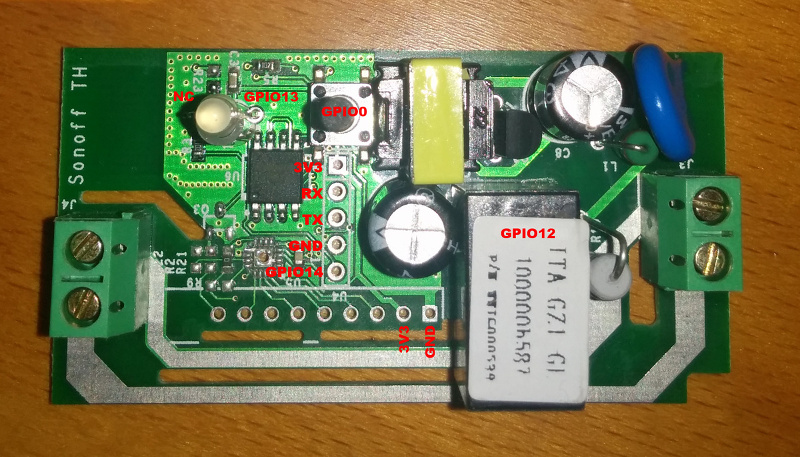
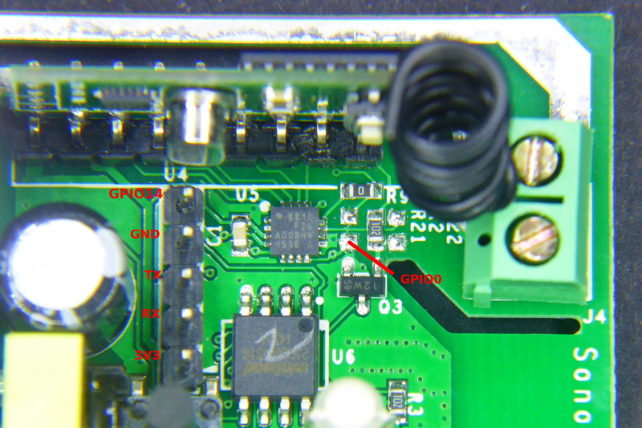
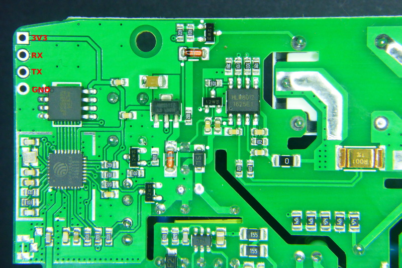
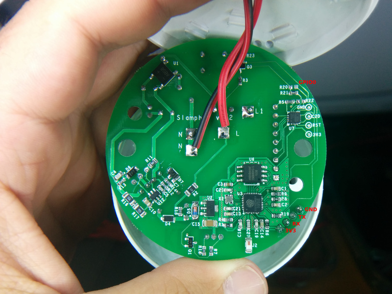
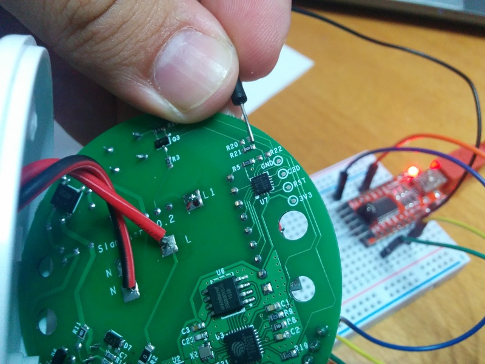
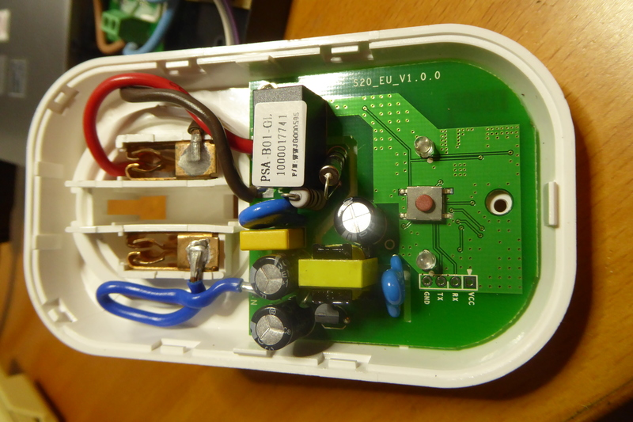

# Supported Hardware

This is the official list of supported hardware for the ESPurna firmware. The hardware configuration for each of these boards can be selected by supplying the build flag (see [Firmware section](Firmware.h)).

**CAUTION: Never ever connect any of these devices to your computer and to mains at the same time. Never ever manipulate them while connected to mains. Seriously. I don't want you to die. I hold no responsibility for any damage to you, your family, your house,... for any action or results derived from flashing or using these devices.**

* [IteadStudio Sonoff](#iteadstudio-sonoff)
* [IteadStudio Sonoff RF](#iteadstudio-sonoff-rf)
* [IteadStudio Sonoff TH](#iteadstudio-sonoff-th)
* [IteadStudio Sonoff POW](#iteadstudio-sonoff-pow)
* [IteadStudio Slampher](#iteadstudio-slampher)
* [IteadStudio S20](#iteadstudio-s20)

## IteadStudio Sonoff

|Property|Value|
|---|---|
|Manufacturer|Itead Studio|
|Web page|https://www.itead.cc/sonoff-wifi-wireless-switch.html|
|Build flag|SONOFF|

The [IteadStudio Sonoff][1] has an ESP8266 on board with a 8Mbit flash memory chip, a mains to 3V3 transformer and a relay (GPIO12). It also features a button (GPIO0), an LED (GPIO13) and an unpopulated header you can use to reprogram it.

### Flashing

The unpopulated header in the Sonoff has all the required pins. My board has a 5 pins header in-line with the button. They are (from the button outwards) 3V3, RX, TX, GND and GPIO14.

Last one is not necessary. Mind it's a **3V3 device**, if connected to 5V you will probably fry it. Button is connected to GPIO0 on the ESP8266 chip, so to enter flash mode you have to hold the button pressed while powering on the board, then you can release it again.

## IteadStudio Sonoff RF

|Property|Value|
|---|---|
|Manufacturer|Itead Studio|
|Web page|[https://www.itead.cc/sonoff-rf.html][2]|
|Build flag|SONOFF_RF|

### Flashing

The Sonoff RF has the same unpopulated header as the Sonoff. It is a 5 pins header in-line with the button. They are (from the button outwards) 3V3, RX, TX, GND and GPIO14.

Solder a male or female header here and connect your USB-to-UART programmer (remember **it's a 3V3 device**). This time through **the button is not connected to GPIO0** but to a EFM8BB1 microcontroller that also monitors the RF module output.

There are a couple of ways to enter flash mode. Some recommend to move 0Ohm R9 resistor to R21 to connect the button directly to the ESP8266 GPIO0 and use it in the same way as for the Sonoff or Sonoff TH. The drawback is the by doing that you lose the RF capability.

My recommendation is to **temporary shortcut the bottom pad of the unpopulated R21 footprint** (see the image above) and connect your USB-to-UART board at the same time. You will have to do it just once (unless there is something really wrong in the firmware) and use OTA updates from there on.

## IteadStudio Sonoff TH

|Property|Value|
|---|---|
|Manufacturer|Itead Studio|
|Web page|https://www.itead.cc/sonoff-th.html|
|Build flag|SONOFF_TH|

### Flashing

You have all the required pins in an unpopulated header in one of the corners of the board (see top left corner in the image above). Solder a 4 pins male or female header here and connect it to your favourite USB-to-UART module. Remember: **it's a 3V3 device**!!.

As in the Sonoff the button is connected to GPIO0, so to enter flash mode press and hold the button and connect the programmer to your computer to power the board.

## IteadStudio Sonoff POW

|Property|Value|
|---|---|
|Manufacturer|Itead Studio|
|Web page|https://www.itead.cc/sonoff-pow.html|
|Build flag|SONOFF_POW|

### Flashing

Same as for the [Sonoff TH](#iteadstudio-sonoff-th) above.

## IteadStudio Slampher

|Property|Value|
|---|---|
|Manufacturer|Itead Studio|
|Web page|https://www.itead.cc/slampher.html|
|Build flag|SLAMPHER|

### Flashing

There is a 4 pin unpopulated header in a border near the ESP8266 chip. Starting form the little white mark this header brings out 3V3, RX, TX and GND. Solder a male or female header here and connect your USB-to-UART programmer (remember it's a 3V3 device). This time through **the button is not connected to GPIO0** but to a EFM8BB1 microcontroller that also monitors the RF module output.

There are a couple of ways to enter flash mode. Some recommend to move R21 to R20 (at the top right of the first picture above) to connect the button directly to the ESP8266 GPIO0 and use it in the same way as for the Sonoff or Sonoff TH. The drawback is the by doing that you lose the RF capability.

My recommendation is to **temporary shortcut the right pad of the unpopulated R20 footprint** (see second image above) and connect your USB-to-UART board at the same time. You will have to do it just once (unless there is something really wrong in the firmware) and use OTA updates from there on.

## IteadStudio S20 Smart Socket

|Property|Value|
|---|---|
|Manufacturer|Itead Studio|
|Web page|https://www.itead.cc/smart-socket.html|
|Build flag|S20|

### Flashing

There is a labeled header in the front of the PCB and the button is connected to GPIO0, so no problems here.

Solder a 4 pin male or female header and connect it to your USB-to-UART bridge. Again, remember **it's a 3V3 device**. Then press and hold the button and connect the programmer to your computer. The microcontroller will boot into flash mode and you are ready to update the firmware.

[1]: https://www.itead.cc/sonoff-wifi-wireless-switch.html
[2]: https://www.itead.cc/sonoff-rf.html
[2]: https://www.itead.cc/sonoff-th.html
[4]: https://www.itead.cc/sonoff-pow.html
[5]: https://www.itead.cc/slampher.html
[6]: https://www.itead.cc/smart-socket.html
